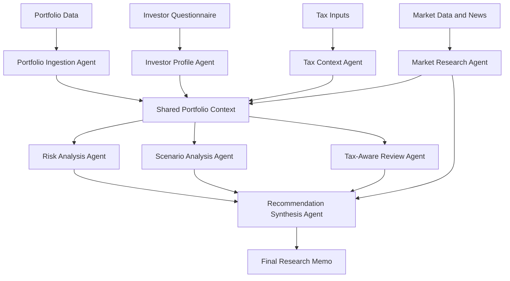

# Portfolio Research Agents

**Portfolio Research Agents** is an open-source framework for building a collaborative team of AI agents that can analyze an investor's portfolio, research markets, understand goals and risk preferences, reason about tax constraints, and produce structured investment analysis.

The project is intended for developers, researchers, and builders interested in applying agentic AI to personal finance, portfolio analytics, market research, and decision support.

> **Important:** This project is for research, education, and decision-support tooling only. It does not provide financial, investment, legal, accounting, or tax advice. Any output generated by the system should be reviewed by a qualified professional before being used for real financial decisions.

---

## Why This Project?

Most portfolio tools focus on dashboards, charts, or static reports. Real financial decision-making is more complex.

A useful system should be able to ask and answer questions such as:

- What does this portfolio actually hold?
- What risks are concentrated across accounts, sectors, factors, geographies, currencies, or asset classes?
- How has the portfolio behaved across different market regimes?
- What is the investor trying to accomplish?
- What is the investor's risk tolerance, time horizon, liquidity need, and behavioral profile?
- Are there tax constraints, unrealized gains, wash-sale concerns, account-type constraints, or charitable-giving considerations?
- What market events or macro trends may affect the portfolio?
- What trade-offs exist between risk, return, taxes, simplicity, liquidity, and personal goals?

This repository aims to explore how multiple specialized agents can work together to produce deeper, more transparent, and more useful financial analysis.

---

## Project Vision

The long-term goal is to create a modular multi-agent financial analysis platform where each agent has a clearly defined responsibility, shares structured context with other agents, and contributes to a final research memo or recommendation report.

The system should be:

- **Open source** — licensed under MIT and easy to extend.
- **Modular** — agents can be added, removed, or replaced.
- **Transparent** — reasoning, assumptions, data sources, and limitations should be visible.
- **Developer-friendly** — simple local setup, clear APIs, typed data models, and good documentation.
- **Provider-neutral** — able to work with different LLMs, market data providers, brokers, and portfolio formats.
- **Safe by design** — includes disclaimers, audit trails, human review, and clear separation between analysis and advice.

---

## Example Agent Roles

The project is designed around a team of cooperating agents. Initial agents may include:

### 1. Portfolio Ingestion Agent

Parses portfolio holdings from CSV, brokerage exports, spreadsheets, APIs, or manually entered data.

Responsibilities:

- Normalize tickers, asset classes, account types, cost basis, quantity, price, and market value.
- Identify missing or inconsistent data.
- Build a clean portfolio representation for downstream analysis.

### 2. Market Research Agent

Collects and summarizes market information relevant to the portfolio.

Responsibilities:

- Research companies, ETFs, sectors, macroeconomic trends, interest rates, inflation, earnings, and market sentiment.
- Track relevant news and events.
- Attach source references where available.

### 3. Risk Analysis Agent

Analyzes portfolio risk across multiple dimensions.

Responsibilities:

- Asset allocation analysis.
- Sector and factor concentration.
- Volatility, drawdown, correlation, and diversification analysis.
- Exposure to interest rates, currency, inflation, liquidity, and single-name risk.

### 4. Investor Profile Agent

Builds a structured understanding of the investor's preferences and constraints.

Responsibilities:

- Time horizon.
- Risk tolerance and risk capacity.
- Income needs.
- Liquidity needs.
- Ethical, sector, or personal constraints.
- Behavioral preferences such as simplicity, drawdown tolerance, and rebalancing discipline.

### 5. Tax Context Agent

Models tax-aware constraints and opportunities.

Responsibilities:

- Account type awareness: taxable, IRA, Roth IRA, 401(k), HSA, trust, corporate, etc.
- Unrealized gains and losses.
- Tax-loss harvesting opportunities.
- Holding-period considerations.
- Dividend and income tax sensitivity.
- Wash-sale awareness.
- Charitable giving and gifting considerations.

### 6. Scenario Analysis Agent

Evaluates how the portfolio may behave under different market environments.

Responsibilities:

- Rate increases or decreases.
- Recession scenarios.
- Inflation shocks.
- Equity drawdowns.
- Sector rotation.
- Currency shifts.
- Concentration unwind scenarios.

### 7. Recommendation Synthesis Agent

Combines the work of all agents into a final analysis.

Responsibilities:

- Summarize key findings.
- Identify trade-offs.
- Highlight risks and uncertainties.
- Produce candidate actions.
- Explain assumptions.
- Separate factual analysis from judgment.
- Flag areas requiring professional review.

---

## Example Workflow



---

## Planned Capabilities

### Portfolio Analysis

- Holdings import from CSV and spreadsheet files.
- Asset allocation by account, sector, industry, geography, and asset class.
- Cost basis and unrealized gain/loss tracking.
- Concentration and diversification metrics.
- ETF and mutual fund look-through support.

### Market Research

- Company research.
- ETF and fund research.
- Macro and sector summaries.
- Earnings and news summarization.
- Source-aware research notes.

### Risk Modeling

- Volatility and drawdown analysis.
- Correlation matrix.
- Factor exposure.
- Stress testing.
- Scenario analysis.
- Portfolio drift monitoring.

### Tax-Aware Analysis

- Taxable vs tax-advantaged account treatment.
- Gain/loss harvesting candidates.
- Holding period analysis.
- Dividend and yield tax sensitivity.
- Asset location suggestions.
- Wash-sale warnings.

### Investor Understanding

- Risk profile questionnaire.
- Goal and time-horizon modeling.
- Liquidity and income requirements.
- Behavioral finance prompts.
- Preference-aware recommendation scoring.

### Report Generation

- Markdown research memo.
- Executive summary.
- Detailed analysis appendix.
- Action table with rationale.
- Assumptions and limitations section.
- Human-review checklist.

---

## Suggested Architecture

A possible implementation stack:

- **Python** for agent logic and analytics.
- **FastAPI** for service APIs.
- **Pydantic** for typed schemas.
- **LangGraph**, **CrewAI**, or similar frameworks for agent orchestration.
- **PostgreSQL** or **DuckDB** for portfolio and market data.
- **Vector database** such as Qdrant, Chroma, or pgvector for research memory.
- **OpenAI**, **Anthropic**, **local LLMs**, or other model providers through an abstraction layer.
- **Pandas**, **NumPy**, and **PyPortfolioOpt** for analytics.
- **Streamlit**, **Next.js**, or similar UI layer for dashboards and reports.

The repository does not need to commit to one stack permanently. The core design goal is to keep agents modular and data contracts explicit.

---

## Repository Structure

This repo is a **multi-agent monorepo**. Each agent lives in its own directory under `agents/` with independent dependencies, tests, and documentation.

```text
fin_agents/
├── libs/fin_agents_common/            # Shared LLM + observability
├── config/                            # llm.yaml, observability.yaml
├── docker-compose.yml
├── docs/
├── agents/
│   ├── prediction_market_research_agent/
│   └── prediction_market_signals_agent/
└── .env.example
```

See [docs/architecture.md](./docs/architecture.md) for conventions on adding new agents.

---

## Getting Started

Each agent has its **own virtual environment**. Shared LLM and observability live in `libs/fin_agents_common`.

### Prediction market signals (offline demo)

```bash
git clone git@github.com:ljohri/fin_agents.git
cd fin_agents
cp .env.example .env

./agents/prediction_market_signals_agent/scripts/install.sh
source agents/prediction_market_signals_agent/.venv/bin/activate
python agents/prediction_market_signals_agent/scripts/run_prediction_market_signals.py --offline-demo
```

Report: `agents/prediction_market_signals_agent/data/reports/pred_market_sights.md`

### Prediction market research

```bash
./agents/prediction_market_research_agent/scripts/install.sh
source agents/prediction_market_research_agent/.venv/bin/activate
pm-research list --limit 5
```

### Shared infrastructure (optional)

```bash
docker compose --profile core --profile litellm_proxy --profile observability --profile langfuse up -d
```

---

## Example Output

The final system should produce reports that look like structured investment research memos rather than generic chatbot responses.

Example sections:

1. Executive Summary
2. Portfolio Snapshot
3. Key Risk Exposures
4. Investor Goals and Constraints
5. Tax Considerations
6. Market Context
7. Scenario Analysis
8. Candidate Actions
9. Trade-Offs
10. Open Questions
11. Professional Review Checklist
12. Assumptions and Limitations

---

## Data Sources

The project may support multiple data sources over time.

Possible integrations:

- User-uploaded CSV files.
- Brokerage exports.
- Manual holdings entry.
- Public market data APIs.
- SEC filings.
- ETF and mutual fund holdings.
- Macroeconomic data.
- News and research APIs.
- User-provided tax and account information.

All external data integrations should clearly document licensing, cost, rate limits, reliability, and attribution requirements.

---

## Safety and Responsible Use

Financial analysis tools can influence high-impact decisions. This project should be designed with safety and transparency in mind.

Recommended principles:

- Do not present generated output as guaranteed advice.
- Clearly distinguish analysis, assumptions, uncertainty, and recommendations.
- Encourage human professional review.
- Preserve source references for market research.
- Avoid hidden reasoning in final reports.
- Log data inputs and report-generation steps.
- Avoid direct trade execution unless explicit safety controls are implemented.
- Protect user financial and tax data.
- Support local-first and privacy-preserving workflows where possible.

---

## What This Project Is Not

This project is not:

- A robo-advisor.
- A registered investment adviser.
- A tax-preparation system.
- A broker-dealer.
- A trading bot.
- A guarantee of investment performance.
- A replacement for a qualified financial, legal, or tax professional.

---

## Roadmap

### Phase 1: Foundation

- Define core portfolio, investor, tax, and report schemas.
- Implement CSV portfolio ingestion.
- Add basic portfolio summary analytics.
- Create initial agent interfaces.
- Generate first markdown research memo.

### Phase 2: Agent Collaboration

- Add market research agent.
- Add risk analysis agent.
- Add investor profile agent.
- Add tax context agent.
- Add synthesis agent.
- Add persistent shared context.

### Phase 3: Analytics

- Add portfolio risk metrics.
- Add factor and sector exposure.
- Add scenario analysis.
- Add tax-aware rebalancing checks.
- Add ETF look-through support.

### Phase 4: Developer Platform

- Add API server.
- Add CLI.
- Add plugin interface for data providers.
- Add UI prototype.
- Add example notebooks.
- Improve documentation and tests.

### Phase 5: Advanced Research

- Multi-agent debate and critique.
- Report confidence scoring.
- Guardrails for financial claims.
- Human-in-the-loop review workflows.
- Private/local model support.
- Long-term portfolio memory.

---

## Contributing

Contributions are welcome.

Good first areas to contribute:

- Portfolio importers.
- Financial data schemas.
- Risk analytics.
- Tax-aware analysis modules.
- Market research tools.
- Agent orchestration.
- Report templates.
- Test coverage.
- Documentation.
- Example portfolios.
- UI prototypes.

Before contributing, please open an issue describing the proposed change, especially for major architectural decisions.

---

## Development Principles

This project values:

- Clear data contracts over hidden state.
- Deterministic analytics where possible.
- Explainable outputs.
- Modular agents.
- Practical examples.
- Strong tests.
- Minimal vendor lock-in.
- Security and privacy by design.
- Human review for high-impact conclusions.

---

## Example Issues to Open

- Add support for Fidelity CSV import.
- Add support for Schwab CSV import.
- Define normalized security schema.
- Implement basic asset allocation report.
- Add market research citation format.
- Add tax-loss harvesting candidate detector.
- Add risk tolerance questionnaire.
- Add report-generation template.
- Add LangGraph orchestration prototype.
- Add local LLM provider interface.

---

## License

This project is licensed under the MIT License.

See the `LICENSE` file for details.

---

## Disclaimer

This software is provided for educational and research purposes only.

The authors and contributors are not providing financial, investment, legal, accounting, or tax advice. The software may produce incomplete, inaccurate, outdated, or inappropriate analysis. You are solely responsible for validating all outputs and consulting qualified professionals before making financial decisions.

Use at your own risk.
