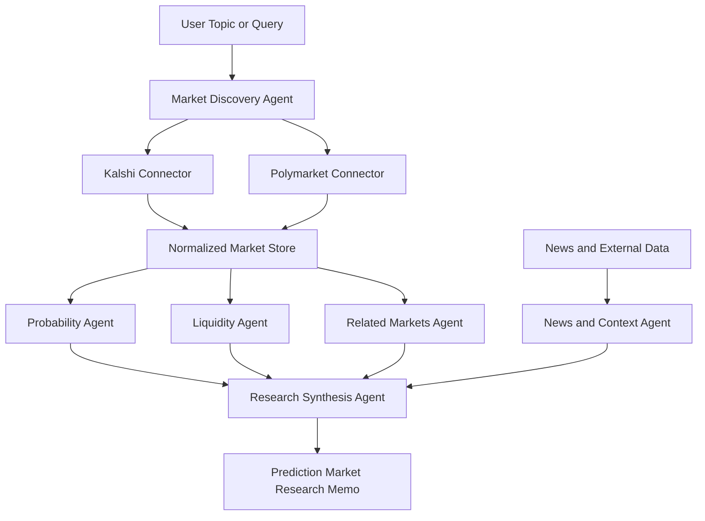

# fin_agents Documentation

This directory contains **repository-wide** documentation: architecture, conventions, and how agents fit together.

Each agent lives under `agents/` and maintains its own `docs/` directory for agent-specific design, API notes, and runbooks.

## Contents

| Document | Description |
|----------|-------------|
| [architecture.md](./architecture.md) | Multi-agent repo layout and conventions |
| [agents.md](./agents.md) | Index of agents in this repository |
| [observability/shared_observability.md](./observability/shared_observability.md) | Shared OTel, Langfuse, LiteLLM |

## Agent documentation

| Agent | Docs |
|-------|------|
| [prediction_market_signals_agent](../agents/prediction_market_signals_agent/) | [Architecture](../agents/prediction_market_signals_agent/docs/architecture/prediction_market_signals.md) · Market ingestion and signal reports |

# Prediction Market Research Agents

**Prediction Market Research Agents** is an open-source framework for collecting, normalizing, analyzing, and reasoning over prediction-market data from venues such as **Kalshi** and **Polymarket**.

The project focuses on building a set of specialized agents that can work together to transform prediction-market prices, order books, market metadata, event outcomes, and external research into structured probabilistic analysis.

The long-term goal is to create a developer-friendly research platform for prediction markets: part data pipeline, part analytics engine, part agentic research system.

> **Disclaimer:** This project is for research, education, and decision-support tooling only. It does not provide investment, trading, legal, tax, or financial advice. Prediction-market trading can involve significant risk. Always verify data, understand market rules, and comply with applicable laws and platform terms.

---

## Why Prediction Markets?

Prediction markets provide a unique source of real-time collective forecasts.

A market price can often be interpreted as an implied probability of an event occurring, subject to important caveats such as fees, liquidity, market structure, trader incentives, regulatory constraints, and settlement rules.

Examples:

- Will inflation be above a certain level?
- Will a candidate win an election?
- Will the Fed cut rates by a certain date?
- Will a company reach a target valuation?
- Will a sports team win a championship?
- Will a macroeconomic event occur before a deadline?

This repository explores how agents can analyze these markets more systematically.

---

## Core Idea

The system should answer questions such as:

- What markets exist for a given topic?
- What probabilities are implied by current prices?
- How have probabilities changed over time?
- What events or news may have moved the market?
- Is liquidity deep enough for the price to be meaningful?
- Are there related markets with inconsistent probabilities?
- Are there cross-market spreads or possible arbitrage-like signals?
- How does the market-implied probability compare with a model forecast?
- What are the key settlement rules and edge cases?
- What open questions should a human researcher review?

---

## Project Scope

This repository focuses first on **prediction-market research**, not broad portfolio management.

Initial scope:

- Kalshi market data ingestion.
- Polymarket market data ingestion.
- Normalized schema for events, markets, outcomes, prices, order books, and trades.
- Probability time-series tracking.
- Liquidity and spread analysis.
- Related-market discovery.
- Research-agent workflows.
- Markdown report generation.
- Backtesting-ready historical data format.

Out of scope for the first version:

- Automated trading.
- Direct trade execution.
- Portfolio recommendations.
- Registered investment-advice workflows.
- Tax planning.
- Broker integration.
- High-frequency execution infrastructure.

These may be explored later, but the first milestone should be a clean prediction-market research engine.

---

## Agent Architecture

The system is organized as a set of specialized agents. Each agent owns one part of the research workflow and produces structured output for the next agent.

### 1. Market Discovery Agent

Finds relevant markets for a topic or query.

Responsibilities:

- Search Kalshi and Polymarket markets.
- Group markets by event, category, date, and settlement condition.
- Identify duplicate or near-duplicate questions.
- Rank markets by relevance, liquidity, and freshness.

Example query:

```text
Fed rate cuts in 2026
```

Example output:

```json
{
  "topic": "Fed rate cuts in 2026",
  "markets": [
    {
      "venue": "kalshi",
      "event_id": "...",
      "market_id": "...",
      "title": "...",
      "close_time": "...",
      "status": "open"
    }
  ]
}
```

### 2. Market Data Agent

Collects raw and normalized market data.

Responsibilities:

- Fetch market metadata.
- Fetch current prices.
- Fetch order books.
- Fetch recent trades where available.
- Store snapshots for historical analysis.
- Track API response metadata and timestamps.

### 3. Probability Agent

Converts prices into usable probability estimates.

Responsibilities:

- Convert bid/ask quotes into implied probabilities.
- Track mid-price, best bid, best ask, spread, and depth.
- Estimate confidence based on liquidity and spread.
- Compare price-derived probability with historical movement.

Example derived fields:

```json
{
  "best_bid_probability": 0.62,
  "best_ask_probability": 0.66,
  "mid_probability": 0.64,
  "spread": 0.04,
  "liquidity_score": 0.71
}
```

### 4. Liquidity and Microstructure Agent

Evaluates whether a market price is meaningful.

Responsibilities:

- Order-book depth analysis.
- Bid/ask spread analysis.
- Market age and time-to-resolution.
- Volume and open interest tracking.
- Thin-market warnings.
- Stale-market detection.

### 5. Related Markets Agent

Finds related markets that may encode similar or contradictory beliefs.

Responsibilities:

- Link markets by topic.
- Detect mutually exclusive outcomes.
- Detect nested outcomes.
- Detect correlated markets.
- Compare implied probabilities across venues.
- Flag possible inconsistency or arbitrage-like structures.

Examples:

- Candidate wins presidency vs candidate wins party nomination.
- Inflation above 3% vs CPI print above expected value.
- Team wins game vs team wins championship.
- Event happens before date X vs before date Y.

### 6. News and Context Agent

Connects market moves to external context.

Responsibilities:

- Summarize relevant news.
- Track official data releases.
- Capture event timelines.
- Identify catalysts for probability changes.
- Separate factual news from speculation.

### 7. Forecast Comparison Agent

Compares prediction-market probabilities with model-based forecasts.

Responsibilities:

- Compare market probability with statistical models.
- Compare with polls, macro models, or historical base rates.
- Track forecast error after resolution.
- Produce calibration analysis.

### 8. Research Synthesis Agent

Produces a structured research memo.

Responsibilities:

- Summarize market-implied probability.
- Explain liquidity caveats.
- Highlight related-market signals.
- List key drivers and upcoming catalysts.
- Identify settlement-rule risks.
- Generate human-review questions.
- Avoid overclaiming.

---

## Example Workflow



---

## Suggested Repository Structure

```text
prediction-market-research-agents/
├── README.md
├── LICENSE
├── pyproject.toml
├── .env.example
├── docs/
│   ├── architecture.md
│   ├── data-model.md
│   ├── kalshi.md
│   ├── polymarket.md
│   ├── agent-design.md
│   ├── market-microstructure.md
│   ├── safety-and-disclaimers.md
│   └── roadmap.md
├── examples/
│   ├── sample-topic-query.yaml
│   ├── sample-market-snapshot.json
│   ├── sample-orderbook.json
│   └── sample-research-memo.md
├── src/
│   └── prediction_market_agents/
│       ├── agents/
│       │   ├── market_discovery.py
│       │   ├── market_data.py
│       │   ├── probability.py
│       │   ├── liquidity.py
│       │   ├── related_markets.py
│       │   ├── news_context.py
│       │   ├── forecast_comparison.py
│       │   └── synthesis.py
│       ├── connectors/
│       │   ├── kalshi.py
│       │   ├── polymarket.py
│       │   └── base.py
│       ├── schemas/
│       │   ├── event.py
│       │   ├── market.py
│       │   ├── outcome.py
│       │   ├── orderbook.py
│       │   ├── trade.py
│       │   ├── probability.py
│       │   └── report.py
│       ├── storage/
│       │   ├── duckdb_store.py
│       │   ├── postgres_store.py
│       │   └── parquet_store.py
│       ├── analytics/
│       │   ├── implied_probability.py
│       │   ├── liquidity_score.py
│       │   ├── spread_analysis.py
│       │   ├── arbitrage_checks.py
│       │   └── calibration.py
│       ├── orchestration/
│       └── reporting/
├── notebooks/
│   ├── kalshi_market_snapshot.ipynb
│   ├── polymarket_market_snapshot.ipynb
│   └── probability_timeseries.ipynb
├── tests/
└── scripts/
    ├── collect_markets.py
    ├── snapshot_orderbooks.py
    └── generate_research_memo.py
```

---

## Normalized Data Model

A key feature of the project is a common schema across venues.

### Event

```json
{
  "event_id": "string",
  "venue": "kalshi | polymarket",
  "title": "string",
  "description": "string",
  "category": "string",
  "tags": ["string"],
  "status": "open | closed | resolved | cancelled",
  "start_time": "datetime",
  "close_time": "datetime",
  "resolution_time": "datetime",
  "source_url": "string"
}
```

### Market

```json
{
  "market_id": "string",
  "venue": "kalshi | polymarket",
  "event_id": "string",
  "question": "string",
  "outcomes": ["yes", "no"],
  "status": "open | closed | resolved | cancelled",
  "resolution_rule": "string",
  "fee_model": "string",
  "min_tick_size": "number",
  "last_price": "number",
  "volume": "number",
  "open_interest": "number",
  "created_at": "datetime",
  "updated_at": "datetime"
}
```

### Order Book Snapshot

```json
{
  "snapshot_id": "string",
  "venue": "kalshi | polymarket",
  "market_id": "string",
  "captured_at": "datetime",
  "yes_bids": [
    {"price": 0.61, "size": 100}
  ],
  "yes_asks": [
    {"price": 0.65, "size": 120}
  ],
  "best_bid": 0.61,
  "best_ask": 0.65,
  "mid": 0.63,
  "spread": 0.04
}
```

---

## Analytics Modules

### Implied Probability

Convert market prices into probability estimates.

Initial features:

- Best bid probability.
- Best ask probability.
- Mid probability.
- Last-traded probability.
- Spread-adjusted confidence.
- Liquidity-adjusted confidence.

### Liquidity Score

Estimate how reliable a market price is.

Possible inputs:

- Bid/ask spread.
- Depth near mid.
- Total volume.
- Open interest.
- Number of active price levels.
- Recency of trades.
- Time to close.

### Cross-Market Consistency

Check relationships between related markets.

Examples:

- Mutually exclusive outcomes should not sum materially above 100% after fees.
- Nested events should have monotonic probability relationships.
- Same event across venues should not diverge without explanation.
- Time-bucketed events should reconcile with broader event probabilities.

### Calibration

After market resolution, evaluate accuracy.

Metrics:

- Brier score.
- Log loss.
- Calibration curves.
- Probability bucket accuracy.
- Forecast-vs-outcome analysis.

---

## Connectors

### Kalshi Connector

Planned support:

- List events.
- List markets.
- Fetch market details.
- Fetch order book.
- Stream real-time order-book updates.
- Store market snapshots.
- Normalize prices and market metadata.

### Polymarket Connector

Planned support:

- Query Gamma market metadata.
- Query public CLOB read endpoints.
- Fetch order books and prices.
- Fetch spreads.
- Map events to markets and token IDs.
- Normalize prices and market metadata.

---

## Getting Started

```bash
git clone https://github.com/YOUR_USERNAME/prediction-market-research-agents.git
cd prediction-market-research-agents

python -m venv .venv
source .venv/bin/activate

pip install -e ".[dev]"
cp .env.example .env
```

Run tests:

```bash
pytest
```

Collect market metadata:

```bash
python scripts/collect_markets.py --venue kalshi --query "fed rate cut"
python scripts/collect_markets.py --venue polymarket --query "inflation"
```

Snapshot order books:

```bash
python scripts/snapshot_orderbooks.py --venue kalshi --market-id MARKET_ID
python scripts/snapshot_orderbooks.py --venue polymarket --market-id MARKET_ID
```

Generate a research memo:

```bash
python scripts/generate_research_memo.py   --topic "Fed rate cuts in 2026"   --venues kalshi polymarket   --output reports/fed-rate-cuts-2026.md
```

---

## Example Research Memo

A generated memo should be structured, source-aware, and cautious.

Example sections:

1. Executive Summary
2. Markets Analyzed
3. Current Implied Probabilities
4. Liquidity and Spread Quality
5. Probability Movement
6. Related Markets
7. News and Catalyst Timeline
8. Cross-Market Inconsistencies
9. Settlement Rules and Ambiguities
10. Researcher Notes
11. Open Questions
12. Limitations

---

## Development Principles

This project values:

- API-first data ingestion.
- No scraping unless absolutely necessary and permitted.
- Clear normalized schemas.
- Reproducible snapshots.
- Point-in-time correctness.
- Transparent assumptions.
- No hidden trading logic.
- Human-review-friendly outputs.
- Strong tests around data normalization.
- Separation between research, analysis, and execution.

---

## Safety and Compliance

Prediction markets can involve regulatory, legal, and platform-specific restrictions.

The project should:

- Respect platform terms of service.
- Avoid scraping when official APIs exist.
- Avoid storing credentials in source code.
- Separate public market data from authenticated trading endpoints.
- Avoid trade execution by default.
- Clearly label experimental analysis.
- Document fee, liquidity, and settlement caveats.
- Preserve timestamps for all market snapshots.
- Record API source and request metadata where practical.

---

## Roadmap

### Phase 1: Data Foundation

- Define normalized schemas.
- Add Kalshi market metadata connector.
- Add Polymarket metadata connector.
- Add order-book snapshot support.
- Store snapshots in DuckDB or Parquet.
- Add sample notebooks.

### Phase 2: Analytics

- Add implied probability calculations.
- Add spread and liquidity scoring.
- Add probability time-series.
- Add related-market linking.
- Add simple cross-market consistency checks.

### Phase 3: Agents

- Add market discovery agent.
- Add probability agent.
- Add liquidity agent.
- Add related markets agent.
- Add research synthesis agent.
- Generate markdown reports.

### Phase 4: Historical Research

- Add scheduled snapshot collection.
- Add backtesting-ready event datasets.
- Add calibration scoring.
- Add market movement attribution.
- Add topic-level dashboards.

### Phase 5: Advanced Research

- Add forecast comparison models.
- Add news/event-catalyst extraction.
- Add arbitrage-like structure detection.
- Add multi-venue probability comparison.
- Add LLM forecasting benchmark integration.
- Add human-in-the-loop review workflows.

---

## Good First Issues

- Define `Market` and `Event` Pydantic schemas.
- Implement Kalshi public market search.
- Implement Polymarket Gamma market search.
- Add DuckDB storage for market snapshots.
- Add order-book normalization.
- Implement bid/ask spread calculation.
- Implement implied probability calculation.
- Create a sample research memo template.
- Add CLI command for topic-based market discovery.
- Add tests for binary-market price normalization.

---

## Contributing

Contributions are welcome.

Useful contribution areas:

- API connectors.
- Data normalization.
- Market microstructure analytics.
- Probability modeling.
- Calibration metrics.
- Research memo templates.
- Documentation.
- Test coverage.
- Example notebooks.
- Agent orchestration.

Please open an issue before major architectural changes.

---

## License

This project is licensed under the MIT License.

See the `LICENSE` file for details.

---

## Disclaimer

This repository is for educational and research purposes only.

It does not provide investment advice, trading advice, legal advice, tax advice, or financial advice. Prediction-market prices may be illiquid, noisy, manipulated, stale, incomplete, or affected by fees and market rules. Any analysis generated by this software should be independently verified.

Use at your own risk.
